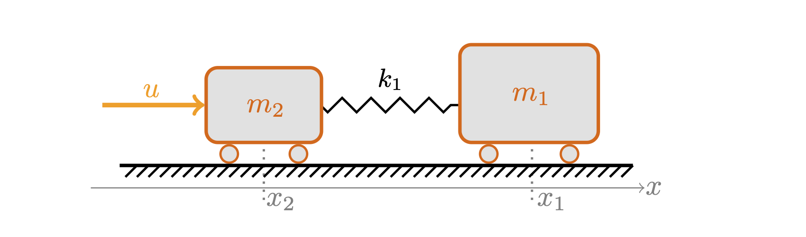

# Introduction

---

**A linear undamped 2-mass spring chain**

. . .

   * the input force $u$ accelerates $m_2$
     * 1st integrator: $m_2$ gains velocity
       * 2nd integrator: $m_2$ changes position

. . .

   * the resulting spring force accelerates $m_1$
     * 3rd integrator: $m_1$ gains velocity
       * 4th integrator: $m_1$ changes position

. . .

---

::: {.r-frame}
it takes 4 integrations to see the effect of $u$ in $x_1$
:::

. . .

   * or $4$ differentiations of $x_1$ to see $u$: relative degree $\delta=4$
   * inverted system: choose a trajectory for $x_1$, find the $u$:
     * relative degree: $\delta=-4$
     * DAE index: $\eta=5=-(-4)+1$

## Relative Degree of a SISO LTI system

\begin{equation}
\begin{split}
\dot x = Ax + Bu\\
y = Cx + Du
\end{split}
\end{equation}

with transfer function

$$G(s) = C(sI-A)^{-1}B + D$$

. . .

 * $G$ is a rational function, e.g. $$G(s)=P(s)/Q(s)$$ with $P$, $Q$ polynomial

::: {.r-frame}
**Relative degree**: $\delta = \operatorname{deg} Q - \operatorname{deg} P$
:::

## Relative Degree and Asymptotic Behavior

   * $\delta>0$: strictly proper: $G(s) \to 0$ for $s\to \infty$

   * $\delta=0$: proper system:  $G(s) \to D$ for $s\to \infty$

   * $\delta < 1$: DAE systems: $G(s)\in \mathcal O(s^\delta)$

# The Relative Degree/Index in Control and Model Reduction

## Control

 * a higher relative degree makes (proportional) output feedback 
 $$u=k(y)$$ less immediate

 * need for higher derivatives 
 $$u=k(y,\dot y, \dotsc, y^{(\delta)})$$

 * see, e.g., the discussion for *funnel control* [@BerLR18]

## Model reduction

 * the index/relative degree determines the asymptotic behavior

 * should be included in the structure of the reduced order model

   * see, e.g., projection-based model reduction for DAEs [@HeiSS08]
   * interpolation of nonproper transfer functions [@GosH24]

. . .

 

::: {.r-frame}
most approaches rely on a-priori knowledge of the degree and high-frequency data
:::

# Rational Interpolation with Prescribed Relative Degree

---

 * approximate the transfer function $G$ through

 * a rational interpolant $\hat G$ at given $m+1$ sample points 
   $$\hat G(s_i) = G(s_i), \quad i=0,1,\dotsc,m$$

 * e.g. through the **barycentric form** 
$$\hat G(s) = \sum_{i=0}^m \frac{G(s_i)w_i}{s - s_i} \Bigg/ \sum_{i=0}^m\frac{w_i}{s - s_i}$$

 * for which the iterative **AAA** [@AntA86] algorithm determines optimal complexity $m$ and
   abscissae $s_i$ and weights $w_i$

## How to Impose a Relative Degree 

 * generically, the barycentric form returns $\hat G$ with $\delta_{\hat G}=0$

 * for, say, $\delta_{\hat G}=-1$, one could set $\hat G(s) = \hat G_0(s) + c_0 + c_1
   s$ and identify $c_0$ and $c_1$ from (high-frequency) data

 * our proposal: rather use constraints on the weights

---

::: {.r-frame}

**Theorem**: ([@BerM97], JH et al. '25) 

Let $\mu$ and $\nu$ be non-negative integers $\leq m$ such that
\begin{equation}
    \begin{cases}
        \sum_{i=0}^mw_if_is_i^l=0\quad\text{for } l=0,1,\ldots,\mu-1,\\
        \sum_{i=0}^mw_if_is_i^\mu\neq 0,
    \end{cases}
\end{equation}
where, for interpolation, $f_i:=G(s_i)$, and
\begin{equation}
    \begin{cases}
        \sum_{i=0}^mw_is_i^l=0\quad\text{for } l=0,1,\ldots,\nu-1,\\
        \sum_{i=0}^mw_is_i^\nu\neq 0.
    \end{cases}
\end{equation}
Then the barycentric form has relative degree $\delta=\nu-\mu$.

:::

. . .

**Note**: These are linear constraints on the weights.

## Practical Implications

  * linear constraints on the weights -- effectively reducing the number of
    *free* model parameters
  * same structure of the models and an *overly fair* method to compare
    different interpolants of possibly higher relative degree

 

. . .

::: {.r-frame}

**We propose the following heuristics:**

 1. for different $\delta$, identify interpolants of smallest complexity $m(\delta)$
 2. define $\delta^{* }$ that achieves lowest complexity as *the* relative degree

:::

# Numerical Results

## The Procedure

 * for different test cases
    * define a reasonable training frequency range
    * test different $\delta$ 
    * identify relative degree (model has lowest complexity)

 * tried AAA and *vector fitting* (VF)

 * also on noisy data

## The results

| Test case | $\delta$ | Training range | AAA(w/noise) | VF (w/noise) |
| --- | --- |  --- | --- |  --- |
| `fwd 2-mass` | $+4$ | $10^{-2}\div 10^0$  | ✅(❌) |  ✅(✅) |
| `bwd 2-mass` | $-4$ | $10^{-2}\div 10^0$  | ✅(❌) |  ✅(✅) |
| `fwd 3-mass` | $+6$ | $10^{-2}\div 10^0$  | ✅(❌) |  ✅(❌) |
| `bwd 3-mass` | $-6$ | $10^{-2}\div 10^0$  | ❌(❌) |  ❌(❌) |
| `Oseen flow` | $-1$ | $10^{-2}\div 10^1$  | ✅(❌) |  ✅(✅) |
| `eady` (SLICOT) | $+1$ | $10^{0}\div 10^3$  | ✅(❌) |  ✅(✅) |
| `beam` (SLICOT) | $+1$ | $10^{-2}\div 10^2$  | ✅(✅) |  ✅(✅) |
| `mna_1` (SLICOT) | $-1$ | $10^{11}\div 10^{12}$  |❌(❌) |  ❌(❌) |

# Conclusion

. . .

 * impose relative degrees $\delta$ on barycentric forms by linear constraints
 * allows for direct comparison of models of different $\delta$
 * applies to different interpolation methods
 * works well across diverse test cases, even with noise
 * preprint: [arxiv:2410.02000](https://arxiv.org/abs/2410.02000), code: [doi:10.5281/zenodo.13838011](https://doi.org/10.5281/zenodo.13838011)

  

## References
